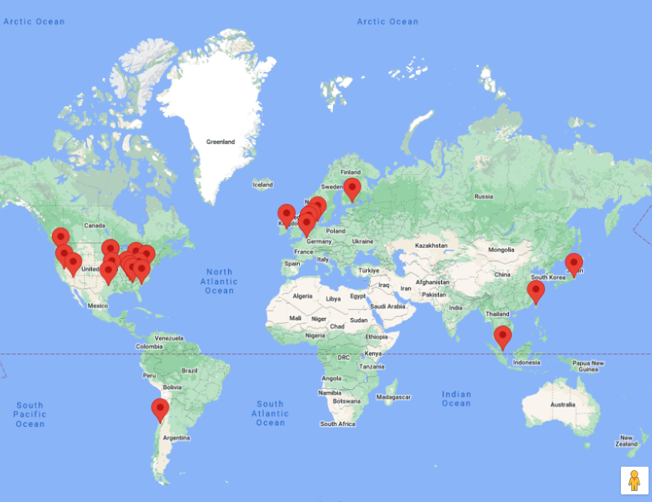

# Highload Google Play

**Автор - [Коноплюк Владимир](https://park.vk.company/profile/ko.vladimir/)**

## Содержание

### [1. Тема, целевая аудитория](#1)

### [2. Расчет нагрузки](#2)

### [3. Глобальная балансировка нагрузки](#3)

### [Список используемых источников](#sources)

## 1. Тема и целевая аудитория 

**Google Play** - магазин приложений, позволяющий сторонним компаниям предлагать владельцам устройств с операционной системой Android устанавливать и приобретать различные приложения.

### MVP

- основные страницы (главная, страницы приложений, каталог)
- поисковая система для нахождения приложений
- регистрация и аутентификация пользователей
- система загрузки приложений
- административная панель управления приложением
- система управления версиями приложений
- система отзывов и рейтинга приложений

### Целевая аудитория

- 2.5 млрд пользователей в месяц [^1]
- более 190 рынков по всему миру [^1]
- 49% - женщины, 51% - мужчины [^2]
- количество авторов в магазине: 1.2 млн [^2]

#### Распределение пользователей по возрасту [^4]

| Возрастная группа | Проведено часов в месяц |
| ----------------- | ----------------------- |
| 18-24             | 112.6                   |
| 25-34             | 102.4                   |
| 35-44             | 93.6                    |
| 45-54             | 75.6                    |
| 55-64             | 69.3                    |
| 65+               | 51.4                    |

#### Распределение пользователей по странам [^4]

| Страна        | Количество часов проведено, млрд ч | Отсносительное значение |
| ------------- | ---------------------------------- | ----------------------- |
| China         | `1 182`                            | `0.40`                  |
| India         | `669`                              | `0.23`                  |
| United States | `194`                              | `0.066`                 |
| Brazil        | `193`                              | `0.066`                 |
| Indonesia     | `155`                              | `0.053`                 |
| Pakistan      | `133`                              | `0.046`                 |
| Philippines   | `109`                              | `0.037`                 |
| Russia        | `108`                              | `0.037`                 |
| Mexico        | `99`                               | `0.034`                 |
| Vietnam       | `79`                               | `0.027`                 |

### Статистика контента

- количество скачиваний приложений: 63 млрд в год [^2]
- количество скачиваний игр: 50 млрд в год [^2]
- количество приложений в магазине: 3.7 млн [^5]
- 97% приложений - бесплатные [^3]
- соотношение количества игр к приложениям - игры: 12.69%, приложения: 87.31% [^6]
- соотношение приложений с рейтингом и без - с рейтингом: 49.54%, без рейтинга: 50.46% [^6]
- среднее количество отзывов на приложение: 967 [^10]

## 2. Расчет нагрузки 

### Продуктовые метрики

Для расчета DAU прмем поправочный коэффициент = `0.2`

- MAU - `2.5 млрд. пользователей` [^1]
- DAU - `2.5 * 0.2 = 0.5 млрд. пользователей`

#### Среднее количество действий пользователя по типам в день по странам

- количество скачиваний приложений всего: `63 млрд/год = 172.6 млн/сутки` [^2]
- количество скачиваний игр всего: `50 млрд/год = 137.0 млн/сутки` [^2]
- среднее количество выпускаемых приложений в день всего - `2 166` [^2]
- среднее количество выпускаемых игр в день всего - `314.8`

Для определения распределния действий по странам используем соотношения между странами из таблицы `Распределение пользователей по странам`

| Тип запроса                            | China   | India   | United States | Brazil  | Indonesia | Pakistan | Philippines | Russia | Mexico | Vietnam |
| -------------------------------------- | ------- | ------- | ------------- | ------- | --------- | -------- | ----------- | ------ | ------ | ------- |
| Поисковые запросы, `млн/сутки`         | `375.8` | `212.7` | `61.7`        | `61.4`  | `49.3`    | `42.3`   | `34.7`      | `34.3` | `31.5` | `25.1`  |
| Скачивание приложения, `млн/сутки`     | `69.8`  | `39.5`  | `11.5`        | `11.4`  | `9.2`     | `7.9`    | `6.4`       | `6.4`  | `5.8`  | `4.7`   |
| Скачивание игр, `млн/сутки`            | `55.4`  | `31.4`  | `9.1`         | `9.1`   | `7.3`     | `6.2`    | `5.1`       | `5.1`  | `4.6`  | `3.7`   |
| Загрузка нового приложения, `ед/сутки` | `876.5` | `496.1` | `143.9`       | `143.1` | `114.9`   | `98.6`   | `80.8`      | `80.1` | `73.4` | `58.6`  |
| Загрузка новой игры, `ед/сутки`        | `127.4` | `72.1`  | `20.9`        | `20.8`  | `16.7`    | `14.3`   | `11.7`      | `11.6` | `10.7` | `8.5`   |
| Отзывы, `млн/сутки`                    | `6.26`  | `3.55`  | `1.03`        | `1.02`  | `0.82`    | `0.70`   | `0.58`      | `0.57` | `0.52` | `0.42`  |

#### Средний размер хранилища пользователя

| Данные                      | Оценочный размер |
| --------------------------- | ---------------- |
| Данные профиля (с аватаром) | `50 KB`          |
| Размер приложения           | `11.5 MB` [^7]   |
| Размер игры                 | `465 MB` [^8]    |
| Размер отзыва               | `1 KB`           |

### Технические метрики

В качестве значения количества пользователей возьмем следующее значение: 70% от 7.1 млрд пользователй всех мобильных устройств [^9]. Получим значение `4.97 млрд пользователй`.

Тогда общий размер хранилища:

`4.97 млрд * 50 KB + 0.87 * 3.7 млн * 11.5 MB + 0.13 * 3.7 млн * 465 MB + 967 * 3.7 млн * 1 KB = 483.3 TB`

#### RPS

<!-- Основная формула расчета:

`RPS = ` -->

| Тип запроса                | China   | India   | United States | Brazil   | Indonesia | Pakistan | Philippines | Russia   | Mexico   | Vietnam  |
| -------------------------- | ------- | ------- | ------------- | -------- | --------- | -------- | ----------- | -------- | -------- | -------- |
| Поисковые запросы          | `4350`  | `2462`  | `714.0`       | `710.3`  | `570.4`   | `489.5`  | `401.1`     | `397.5`  | `364.3`  | `290.7`  |
| Скачивание приложения      | `808.4` | `457.5` | `132.7`       | `132.0`  | `106.0`   | `91.0`   | `74.5`      | `73.9`   | `67.7`   | `54.0`   |
| Скачивание игр             | `641.6` | `363.2` | `105.3`       | `104.8`  | `84.1`    | `72.2`   | `59.2`      | `58.6`   | `53.7`   | `42.9`   |
| Загрузка нового приложения | `0.010` | `0.006` | `0.002`       | `0.002`  | `0.001`   | `0.001`  | `0.001`     | `0.001`  | `0.001`  | `0.001`  |
| Загрузка новой игры        | `0.001` | `0.001` | `0.0002`      | `0.0002` | `0.0002`  | `0.0002` | `0.0001`    | `0.0001` | `0.0001` | `0.0001` |
| Отзывы                     | `72.5`  | `41.0`  | `11.9`        | `11.8`   | `9.5`     | `8.2`    | `6.7`       | `6.6`    | `6.1`    | `4.8`    |

#### Сетевой трафик

Примем среднюю скорость сети `10 Мбит/с`. Тогда сетевой трафик в `Гбит/с`

| Тип запроса                          | China     | India     | United States | Brazil    | Indonesia | Pakistan  | Philippines | Russia    | Mexico    | Vietnam   |
| ------------------------------------ | --------- | --------- | ------------- | --------- | --------- | --------- | ----------- | --------- | --------- | --------- |
| Поисковые запросы, `Гбит/с`          | `43.5`    | `24.6`    | `7.14`        | `7.10`    | `5.70`    | `4.89`    | `4.01`      | `3.97`    | `3.64`    | `2.91`    |
| Скачивание приложения, `Гбит/с`      | `8.08`    | `4.58`    | `1.33`        | `1.32`    | `1.06`    | `0.91`    | `0.75`      | `0.74`    | `0.68`    | `0.54`    |
| Скачивание игр, `Гбит/с`             | `6.42`    | `3.63`    | `1.05`        | `1.05`    | `0.84`    | `0.72`    | `0.59`      | `0.59`    | `0.54`    | `0.43`    |
| Загрузка нового приложения, `Гбит/с` | `1.0E-04` | `5.7E-05` | `1.7E-05`     | `1.7E-05` | `1.3E-05` | `1.1E-05` | `9.4E-06`   | `9.3E-06` | `8.5E-06` | `6.8E-06` |
| Загрузка новой игры, `Гбит/с`        | `1.5E-05` | `8.3E-06` | `2.4E-06`     | `2.4E-06` | `1.9E-06` | `1.7E-06` | `1.4E-06`   | `1.3E-06` | `1.2E-06` | `9.9E-07` |
| Отзывы                               | `0.73`    | `0.41`    | `0.12`        | `0.12`    | `0.10`    | `0.08`    | `0.07`      | `0.07`    | `0.06`    | `0.05`    |
| Суммарный суточный, `Пбит/с`         | `5.1`     | `2.9`     | `0.8`         | `0.8`     | `0.7`     | `0.6`     | `0.5`       | `0.5`     | `0.4`     | `0.3`     |

#### Ожидаемый прирост

В течении ближайших пяти лет согласно [^9], если брать в расчет рост предыдущих лет, рост количества скачиваемых приложений и игр в год может составить порядка `50 %`.

#### 3. Глобальная балансировка нагрузки 

Согласно [^11] распределение дата центров по всему миру примем следующей:

**North America**

- Berkeley County, South Carolina
- Council Bluffs, Iowa
- The Dalles, Oregon
- Douglas County, Georgia
- Henderson, Nevada
- Jackson County, Alabama
- Lenoir, North Carolina
- Loudoun County, Virginia
- Mayes County, Oklahoma
- Midlothian, Texas
- Montgomery County, Tennessee
- New Albany, Ohio
- Papillion, Nebraska
- Storey County, Nevada

**South America**

- Quilicura, Chile

**Europe**

- Dublin, Ireland
- Eemshaven, Netherlands
- Fredericia, Denmark
- Hamina, Finland
- Middenmeer, Netherlands
- St. Ghislain, Belgium

**Asia**

- Changhua County, Taiwan
- Inzai, Japan
- Singapore

## Список используемых источников 

[^1]: [How Google Play works](https://play.google/howplayworks/)
[^2]: [Google Play Store Revenue, Ratings & Subscription Stats 2024](https://prioridata.com/data/google-play-revenue-statistics/)
[^3]: [Key Google Play Store Statistics in 2024](https://www.pagetraffic.in/blog/google-play-store-statistics/)
[^4]: [Google Play Store Statistics and Trends in 2022- 2023](https://www.emizentech.com/blog/google-play-store-statistics.html)
[^5]: [How Many Apps In Google Play Store? (Feb 2024) (Source: https://www.bankmycell.com/blog/number-of-google-play-store-apps/)](https://www.bankmycell.com/blog/number-of-google-play-store-apps/)
[^6]: [Google Play Statistics and Trends 2024](https://42matters.com/google-play-statistics-and-trends#apps-released-per-day)
[^7]: [Average App File Size: Data for Android and iOS Mobile Apps](https://sweetpricing.com/blog/index.html%3Fp=4250.html#:~:text=Average%20Android%20and%20iOS%20file,file%20size%20is%2034.3MB.)
[^8]: [Average mobile game file size increased 76% over last five years](https://www.businessofapps.com/news/average-mobile-game-file-size-increased-76-over-last-five-years/#:~:text=According%20to%20research%20from%20SensorTower,compared%20to%20465MB%20in%202020.)
[^9]: [Top Google Play Store Statistics 2023 – Exploring The Key Insights](https://bigohtech.com/google-play-store-statistics/)
[^10]: [Mobile App Ratings and Reviews: 2022 Benchmarks](https://www.alchemer.com/resources/blog/mobile-app-ratings-and-reviews-2022-benchmarks/)
[^11]: [Discover our data center locations](https://www.google.com/about/datacenters/locations/)
