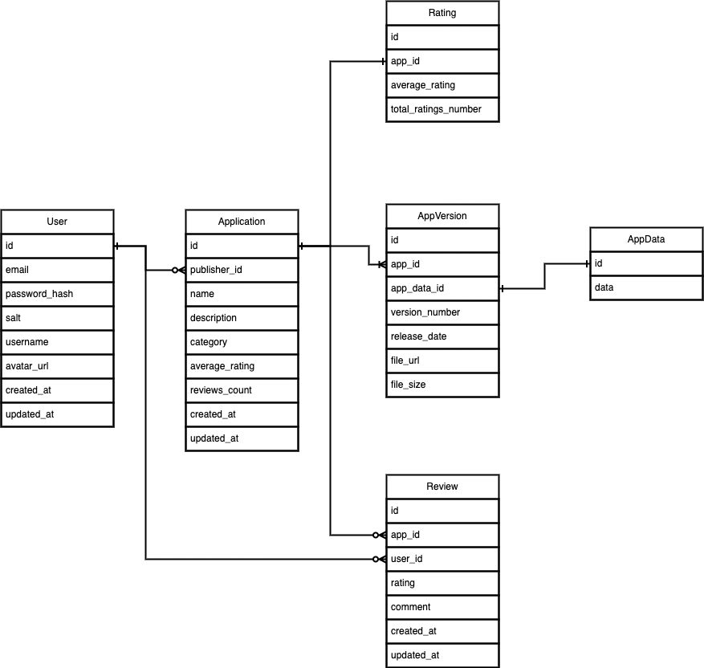

# Highload Google Play <!-- omit from toc -->

**Автор - [Коноплюк Владимир](https://park.vk.company/profile/ko.vladimir/)**

## Содержание <!-- omit from toc -->

- [1. Тема и целевая аудитория](#1-тема-и-целевая-аудитория)
  - [1.1. MVP](#11-mvp)
  - [1.2. Целевая аудитория](#12-целевая-аудитория)
    - [1.2.1. Распределение пользователей по возрасту](#121-распределение-пользователей-по-возрасту)
    - [1.2.2. Распределение пользователей по странам](#122-распределение-пользователей-по-странам)
  - [1.3. Статистика контента](#13-статистика-контента)
- [2. Расчет нагрузки](#2-расчет-нагрузки)
  - [2.1. Продуктовые метрики](#21-продуктовые-метрики)
    - [2.1.1. Среднее количество действий пользователя по типам в день по странам](#211-среднее-количество-действий-пользователя-по-типам-в-день-по-странам)
    - [2.1.2. Средний размер хранилища пользователя](#212-средний-размер-хранилища-пользователя)
  - [2.2. Технические метрики](#22-технические-метрики)
    - [2.2.1. RPS](#221-rps)
    - [2.2.2. Пиковый RPS](#222-пиковый-rps)
    - [2.2.3. Сетевой трафик](#223-сетевой-трафик)
    - [2.2.4. Ожидаемый прирост](#224-ожидаемый-прирост)
- [3. Глобальная балансировка нагрузки](#3-глобальная-балансировка-нагрузки)
  - [3.1. Расположение дата центров](#31-расположение-дата-центров)
  - [3.2. Алгоритм глобальной балансировки](#32-алгоритм-глобальной-балансировки)
- [4. Локальная балансировка нагрузки](#4-локальная-балансировка-нагрузки)
  - [4.1. Схема балансировки для входящих и межсервисных запросов](#41-схема-балансировки-для-входящих-и-межсервисных-запросов)
  - [4.2. Схема отказоустойчивости](#42-схема-отказоустойчивости)
  - [4.3. Нагрузка по терминации SSL](#43-нагрузка-по-терминации-ssl)
- [5. Логическая схема БД](#5-логическая-схема-бд)
  - [5.1. Логическая схема данных](#51-логическая-схема-данных)
  - [5.2. Размер данных](#52-размер-данных)
  - [5.3. Нагрузка на чтение/запись](#53-нагрузка-на-чтениезапись)
- [6. Физическая схема БД](#6-физическая-схема-бд)
  - [6.1. Хранение основных данных](#61-хранение-основных-данных)
    - [6.1.1. Индексирование](#611-индексирование)
    - [6.1.2. Шардинг](#612-шардинг)
    - [6.1.3. Партиционирование](#613-партиционирование)
    - [6.1.4. Репликация](#614-репликация)
  - [6.2. Кеширование данных](#62-кеширование-данных)
  - [6.3. Резервное копирование](#63-резервное-копирование)
  - [6.4. Хранение файлов приложений и аватарок](#64-хранение-файлов-приложений-и-аватарок)
- [7. Технологии](#7-технологии)
  - [7.1. Язык программирования](#71-язык-программирования)
  - [7.2. Хранилища](#72-хранилища)
  - [7.3. Балансировка нагрузки](#73-балансировка-нагрузки)
  - [7.4. Оркестрация](#74-оркестрация)
  - [7.5. Мониториг и логирование](#75-мониториг-и-логирование)
- [8. Схема проекта](#8-схема-проекта)
- [9. Обеспечение надежности](#9-обеспечение-надежности)
  - [9.1. Резервирование](#91-резервирование)
  - [9.2. Мониторинг и оповещение](#92-мониторинг-и-оповещение)
  - [9.3. Обновление и патчинг](#93-обновление-и-патчинг)
  - [9.4. Разделение прав и доступа](#94-разделение-прав-и-доступа)
  - [9.5. Разработка с учетом безопасности](#95-разработка-с-учетом-безопасности)
  - [9.6. Прочие методы обеспечения надежности](#96-прочие-методы-обеспечения-надежности)
- [10. Базовый расчёт аппаратных ресурсов](#10-базовый-расчёт-аппаратных-ресурсов)
  - [10.1. Распределение ресурсов по сервисам](#101-распределение-ресурсов-по-сервисам)
    - [10.1.1. Китай](#1011-китай)
    - [10.1.2. Индия](#1012-индия)
    - [10.1.3. США](#1013-сша)
    - [10.1.4. Бразилия](#1014-бразилия)
    - [10.1.5. Индонезия](#1015-индонезия)
    - [10.1.6. Пакистан](#1016-пакистан)
    - [10.1.7. Филипины](#1017-филипины)
    - [10.1.8. Россия](#1018-россия)
    - [10.1.9. Мексика](#1019-мексика)
    - [10.1.10. Вьетнам](#10110-вьетнам)
- [11. Список используемых источников](#11-список-используемых-источников)

## 1. Тема и целевая аудитория

**Google Play** - магазин приложений, позволяющий сторонним компаниям предлагать владельцам устройств с операционной системой Android устанавливать и приобретать различные приложения.

### 1.1. MVP

- основные страницы (главная, страницы приложений, каталог)
- поисковая система для нахождения приложений
- регистрация и аутентификация пользователей
- система загрузки приложений
- административная панель управления приложением
- система управления версиями приложений
- система отзывов и рейтинга приложений

### 1.2. Целевая аудитория

- `2.5 млрд` пользователей в месяц [^1]
- более `190` рынков по всему миру [^1]
- `49%` - женщины, `51%` - мужчины [^2]
- количество авторов в магазине: `1.2 млн` [^2]

#### 1.2.1. Распределение пользователей по возрасту

Согласно [^4] имеем

| Возрастная группа | Проведено часов в месяц |
| ----------------- | ----------------------- |
| `18-24`           | `112.6`                 |
| `25-34`           | `102.4`                 |
| `35-44`           | `93.6`                  |
| `45-54`           | `75.6`                  |
| `55-64`           | `69.3`                  |
| `65+`             | `51.4`                  |

#### 1.2.2. Распределение пользователей по странам

Согласно [^4] имеем

| Страна        | Количество часов проведено, млрд ч | Относительное значение |
| ------------- | ---------------------------------- | ---------------------- |
| China         | `1 182`                            | `0.40`                 |
| India         | `669`                              | `0.23`                 |
| United States | `194`                              | `0.066`                |
| Brazil        | `193`                              | `0.066`                |
| Indonesia     | `155`                              | `0.053`                |
| Pakistan      | `133`                              | `0.046`                |
| Philippines   | `109`                              | `0.037`                |
| Russia        | `108`                              | `0.037`                |
| Mexico        | `99`                               | `0.034`                |
| Vietnam       | `79`                               | `0.027`                |

### 1.3. Статистика контента

- количество скачиваний приложений: `63 млрд в год` [^2]
- количество скачиваний игр: `50 млрд в год` [^2]
- количество приложений в магазине: `3.7 млн` [^5]
- `97%` приложений - бесплатные [^3]
- соотношение количества игр к приложениям - игры: `12.69%`, приложения: `87.31%` [^6]
- соотношение приложений с рейтингом и без - с рейтингом: `49.54%`, без рейтинга: `50.46%` [^6]
- среднее количество отзывов на приложение: `967` [^10]

## 2. Расчет нагрузки

### 2.1. Продуктовые метрики

Для расчета DAU примем поправочный коэффициент = `0.2`

- MAU - `2.5 млрд. пользователей` [^1]
- DAU - `2.5 * 0.2 = 0.5 млрд. пользователей`

#### 2.1.1. Среднее количество действий пользователя по типам в день по странам

Рассчитаем количество действий пользователя по типам в день во всем мире.

- поисковые запросы - предположим, что пользователь делает 3 поисковых запроса на одно скачивание игры или приложения, тогда поисковых запросов всего: `3 * (63 + 50) млрд/год = 339 млрд/год ~ 1 млрд/сутки`
- количество скачиваний приложений всего: `63 млрд/год = 172.6 млн/сутки` [^2]
- количество скачиваний игр всего: `50 млрд/год = 137.0 млн/сутки` [^2]
- среднее количество выпускаемых приложений в день всего - `2 166 ед/сутки` [^2]
- среднее количество выпускаемых игр в день всего - `314.8 ед/сутки`
- публикация отзывов - согласно [^16] порядка 50% пользователе могут оставлять отзывы в месяц, тогда среднее количество публикуемых отзывов в день: `2.5 млрд * 0.5 = 1.25 млрд/месяц = 41 млн/сутки`
- получение отзывов - примем, что порядок это величина сопоставим с порядком количества поисковых запросов: `1 млрд/сутки`

Для определения распределения действий по странам умножим соотношения между странами из пункта [распределения пользователей по странам](#122-распределение-пользователей-по-странам) на соответствующее значение выше.

| Тип запроса                            | China   | India   | United States | Brazil  | Indonesia | Pakistan | Philippines | Russia  | Mexico  | Vietnam |
| -------------------------------------- | ------- | ------- | ------------- | ------- | --------- | -------- | ----------- | ------- | ------- | ------- |
| Поисковые запросы, `млн/сутки`         | `400`   | `230`   | `66`          | `66`    | `53`      | `46`     | `37`        | `37`    | `34`    | `27`    |
| Скачивание приложения, `млн/сутки`     | `69.04` | `39.69` | `11.39`       | `11.39` | `9.147`   | `7.939`  | `6.386`     | `6.386` | `5.868` | `4.660` |
| Скачивание игр, `млн/сутки`            | `54.8`  | `31.51` | `9.042`       | `9.042` | `7.261`   | `6.302`  | `5.069`     | `5.069` | `4.658` | `3.699` |
| Загрузка нового приложения, `ед/сутки` | `866`   | `498`   | `143`         | `143`   | `115`     | `100`    | `80`        | `80`    | `74`    | `58`    |
| Загрузка новой игры, `ед/сутки`        | `126`   | `72`    | `21`          | `21`    | `17`      | `14`     | `12`        | `12`    | `11`    | `8`     |
| Публикация отзывов, `млн/сутки`        | `16.4`  | `9.43`  | `2.706`       | `2.706` | `2.173`   | `1.886`  | `1.517`     | `1.517` | `1.394` | `1.107` |
| Получение отзывов, `млн/сутки`         | `400`   | `230`   | `66`          | `66`    | `53`      | `46`     | `37`        | `37`    | `34`    | `27`    |

#### 2.1.2. Средний размер хранилища пользователя

| Данные                      | Оценочный размер |
| --------------------------- | ---------------- |
| Данные профиля (с аватаром) | `0.1 MB`         |
| Размер приложения           | `10 MB` [^7]     |
| Размер игры                 | `500 MB` [^8]    |
| Размер отзыва               | `1 KB`           |

### 2.2. Технические метрики

В качестве значения количества пользователей возьмем следующее значение: 70% от 7.1 млрд пользователей всех мобильных устройств [^9]. Получим значение `4.97 млрд пользователей`.

Тогда общий размер хранилища:

`4.97 млрд * 0.1 MB + 87% * (3.7 млн * 10 MB) + 13% * (3.7 млн * 500 MB) + 967 * (3.7 млн * 0.001 MB) = 773.3 TB`

#### 2.2.1. RPS

RPS рассчитаем для каждой страны из распределения [среднего количества действий пользователя по типам в день по странам](#211-среднее-количество-действий-пользователя-по-типам-в-день-по-странам). Разделим каждое значение на количество секунд в дне (`60 * 60 * 24 = 86400`)

| Тип запроса                | China    | India    | United States | Brazil   | Indonesia | Pakistan | Philippines | Russia   | Mexico   | Vietnam  |
| -------------------------- | -------- | -------- | ------------- | -------- | --------- | -------- | ----------- | -------- | -------- | -------- |
| Поисковые запросы          | `4630`   | `2662`   | `764`         | `764`    | `613`     | `532`    | `428`       | `428`    | `394`    | `313`    |
| Скачивание приложения      | `799`    | `459`    | `132`         | `132`    | `106`     | `92`     | `74`        | `74`     | `68`     | `54`     |
| Скачивание игр             | `634`    | `365`    | `105`         | `105`    | `84`      | `73`     | `59`        | `59`     | `54`     | `43`     |
| Загрузка нового приложения | `0.010`  | `0.006`  | `0.002`       | `0.002`  | `0.001`   | `0.001`  | `0.001`     | `0.001`  | `0.001`  | `0.001`  |
| Загрузка новой игры        | `0.0015` | `0.0008` | `0.0002`      | `0.0002` | `0.0002`  | `0.0002` | `0.0001`    | `0.0001` | `0.0001` | `0.0001` |
| Публикация отзывов         | `190`    | `109`    | `31`          | `31`     | `25`      | `22`     | `18`        | `18`     | `16`     | `13`     |
| Получение отзывов          | `4630`   | `2662`   | `764`         | `764`    | `613`     | `532`    | `428`       | `428`    | `394`    | `313`    |
| Суммарный                  | `10882`  | `6257`   | `1796`        | `1796`   | `1442`    | `1251`   | `1007`      | `1007`   | `925`    | `735`    |

#### 2.2.2. Пиковый RPS

Пиковый RPS оценим умножив рассчитанный RPS на 3.

| Тип запроса                | China    | India    | United States | Brazil   | Indonesia | Pakistan | Philippines | Russia   | Mexico   | Vietnam  |
| -------------------------- | -------- | -------- | ------------- | -------- | --------- | -------- | ----------- | -------- | -------- | -------- |
| Поисковые запросы          | `13889`  | `7986`   | `2292`        | `2292`   | `1840`    | `1597`   | `1285`      | `1285`   | `1181`   | `938`    |
| Скачивание приложения      | `2397`   | `1378`   | `396`         | `396`    | `318`     | `276`    | `222`       | `222`    | `204`    | `162`    |
| Скачивание игр             | `1903`   | `1094`   | `314`         | `314`    | `252`     | `219`    | `176`       | `176`    | `162`    | `128`    |
| Загрузка нового приложения | `0.0301` | `0.0173` | `0.0050`      | `0.0050` | `0.0040`  | `0.0035` | `0.0028`    | `0.0028` | `0.0026` | `0.0020` |
| Загрузка новой игры        | `0.0044` | `0.0025` | `0.0007`      | `0.0007` | `0.0006`  | `0.0005` | `0.0004`    | `0.0004` | `0.0004` | `0.0003` |
| Публикация отзывов         | `569`    | `327`    | `94`          | `94`     | `75`      | `65`     | `53`        | `53`     | `48`     | `38`     |
| Получение отзывов          | `13889`  | `7986`   | `2292`        | `2292`   | `1840`    | `1597`   | `1285`      | `1285`   | `1181`   | `938`    |
| Суммарный                  | `32647`  | `18772`  | `5387`        | `5387`   | `4326`    | `3754`   | `3020`      | `3020`   | `2775`   | `2204`   |

#### 2.2.3. Сетевой трафик

Примем среднюю скорость сети `10 Мбит/с`. Тогда сетевой трафик в `Гбит/с`

| Тип запроса                          | China     | India     | United States | Brazil   | Indonesia | Pakistan | Philippines | Russia   | Mexico   | Vietnam  |
| ------------------------------------ | --------- | --------- | ------------- | -------- | --------- | -------- | ----------- | -------- | -------- | -------- |
| Поисковые запросы, `Гбит/с`          | `138.889` | `79.861`  | `22.917`      | `22.917` | `18.403`  | `15.972` | `12.847`    | `12.847` | `11.806` | `9.375`  |
| Скачивание приложения, `Гбит/с`      | `23.972`  | `13.784`  | `3.955`       | `3.955`  | `3.176`   | `2.757`  | `2.217`     | `2.217`  | `2.038`  | `1.618`  |
| Скачивание игр, `Гбит/с`             | `19.028`  | `10.941`  | `3.140`       | `3.140`  | `2.521`   | `2.188`  | `1.760`     | `1.760`  | `1.617`  | `1.284`  |
| Загрузка нового приложения, `Мбит/с` | `0.301`   | `0.173`   | `0.050`       | `0.050`  | `0.040`   | `0.035`  | `0.028`     | `0.028`  | `0.026`  | `0.020`  |
| Загрузка новой игры, `Мбит/с`        | `0.044`   | `0.025`   | `0.007`       | `0.007`  | `0.006`   | `0.005`  | `0.004`     | `0.004`  | `0.004`  | `0.003`  |
| Публикация отзывов, `Гбит/с`         | `5.694`   | `3.274`   | `0.940`       | `0.940`  | `0.755`   | `0.655`  | `0.527`     | `0.527`  | `0.484`  | `0.384`  |
| Получение отзывов, `Гбит/с`          | `138.889` | `79.861`  | `22.917`      | `22.917` | `18.403`  | `15.972` | `12.847`    | `12.847` | `11.806` | `9.375`  |
| Суммарный, `Гбит/с`                  | `326.473` | `187.722` | `53.868`      | `53.868` | `43.258`  | `37.544` | `30.199`    | `30.199` | `27.750` | `22.037` |
| Суммарный суточный, `Пбит`           | `28.207`  | `16.219`  | `4.654`       | `4.654`  | `3.737`   | `3.243`  | `2.609`     | `2.609`  | `2.397`  | `1.903`  |

#### 2.2.4. Ожидаемый прирост

В течении ближайших пяти лет согласно [^9], если брать в расчет рост предыдущих лет, рост количества скачиваемых приложений и игр в год может составить порядка `50 %`.

## 3. Глобальная балансировка нагрузки

### 3.1. Расположение дата центров

За основу возьмем данные о распределение дата центров Google по всему миру [^11]:

Согласно данным в первом и втором разделах, страны с наибольшим количеством трафика:

- China
- India
- United States
- Brazil
- Indonesia
- Pakistan
- Philippines
- Russia
- Mexico
- Vietnam

Согласно [^12] плотность населения Земли представлена на рисунке снизу.

Выберем датацентры в местах с наибольшей плотностью населения:

- Лудун, Вирджиния, США
- Стори-Каунти, Невада, США
- Мидлотиан, Техас, США
- Чжанхуа, Тайвань
- Нью-Дели, Индия
- Сингапур
- Индзай, Япония
- Киликура, Чили
- Сен-Гилен, Бельгия

Все расположения представлены на карте ниже.

### 3.2. Алгоритм глобальной балансировки

- Для глобальной балансировки между континентами будем использовать `Latency based DNS` балансировку, что позволит отправлять запросы от клиентов в те ДЦ, соответствующие минимальной задержке.
- Для обслуживания наиболее удаленных от дата центров клиентов - будем использовать `BGP Anycast` до `CDN`

## 4. Локальная балансировка нагрузки

### 4.1. Схема балансировки для входящих и межсервисных запросов

В качестве основной схемы балансировки нагрузки примем следующую схему:

1. `DNS балансировка` - входящие запросы перенаправляются на хосты с `nginx`
2. `L7 балансировка` - на машинах с `nginx` происходит терминация SSL соединения и дальше запросы отправляются на сервера по `HTTP`
3. `K8` - оркестрация сервисов:
   - auto-scaling
   - service discovery
   - распределение экземпляров по узлам и Availability Zones

В качестве алгоритма балансировки нагрузки используем стандартный для `nginx` - `Round Robin`, так как предполагается, что бэкенд приложение будет написано на языке Go, который не блокирует приложение.

### 4.2. Схема отказоустойчивости

Для повышения отказоустойчивости:

- используем пассивную проверку бэкендов в `nginx`, настроив оптимальные timeout'ы
- учитывая проблемы `nginx` с чтением больших конфигов, будем оптимизировать их объем

### 4.3. Нагрузка по терминации SSL

Согласно [^13], обычный хэндшейк TLS соединения может составлять до `250 мс`. Однако, если использовать кеширование сессий, то время хэндшейка можно сократить до `150 мс`. Поэтому в нашем проекте будем использовать `тикеты сессий`, которые кешируются у клиента.

## 5. Логическая схема БД

### 5.1. Логическая схема данных

Схема логической базы данных, согласно [MVP](#mvp) представлена ниже

### 5.2. Размер данных

Для расчета размера данных и нагрузки на чтение/запись примем:

- средний размер записи о пользователе без аватарок (таблица `Application`) - `1 KB`
- средний размер записи о приложении (таблица `Application`) - `1 KB`
- средний размер записи о версии приложения (таблица `AppVersion`) - `100 KB`
- средний размер отзыва (таблица `Review`) - `1 KB`.
- средний размер записи о рейтинге (таблица `Rating`) - `10 B`.
- среднее количество версий на приложение - `3`

Тогда, согласно техническим данным, общий размер данных будет составлять

| Таблица       | Величина                       |
| ------------- | ------------------------------ |
| `User`        | `500e6 * 1 KB = 0.5 TB`        |
| `Application` | `3.7e6 * 1 KB = 3.7 GB`        |
| `AppVersion`  | `3.7e6 * 3 * 100 KB = 1.11 TB` |
| `Review`      | `967 * 3.7e6 * 1 KB = 3.5 TB`  |
| `Rating`      | `3.7e6 * 10 B = 37 MB`         |

Итого, общий объем данных в бд составить примерно `5 TB`, не считая самих файлов приложений и аватарки пользователей.

Сами приложения и аватарки будем хранить отдельно с использованием распределенной системы хранения объектов (S3).

### 5.3. Нагрузка на чтение/запись

**Чтение**: Предполагается, что большинство операций будет связано с чтением данных, особенно информации о приложениях, отзывах и рейтингах. При среднем RPS (requests per second) в `1000` для чтения данных о приложениях и отзывах, нагрузка на чтение будет значительной

**Запись**: Нагрузка на запись будет меньше и в основном будет связана с регистрацией новых пользователей, добавлением новых приложений и версий, а также оставлением отзывов. При среднем RPS в `100` для операций записи, нагрузка будет умеренной.

[Подробнее про расчет](#2-расчет-нагрузки)

## 6. Физическая схема БД

### 6.1. Хранение основных данных

В качестве основной базы данных, для хранения информации о пользователях, приложениях (не самих приложений), отзывах будем использовать реляционную СУБД `PostgreSQL`, так как эти данные структурированы и хорошо ложатся на данную модель. `PostgreSQL` обладает высокой надежностью, поддержкой транзакций и широким набором функциональности.

#### 6.1.1. Индексирование

Для ускорения доступа к данным будем применять индексирование. По умолчанию все первичные ключи в `PostgreSQL` индексируются сразу.

##### Пользователи (таблица `User`) <!-- omit from toc -->

- уникальный индекс на `email` для быстрого поиска и проверки уникальности

##### Приложения (таблица `Application`) <!-- omit from toc -->

- индекс на `publisher_id` для быстрого поиска всех приложений, опубликованных конкретным пользователем
- индекс на `name` и `category`, для быстрого поиска и сортировки по этим полям

##### Версии приложений (таблица `AppVersion`) <!-- omit from toc -->

- индекс на `app_id` и `version_number` для быстрого поиска конкретной версии приложения

##### Отзывы (таблица `Review`) <!-- omit from toc -->

- индекс на `app_id` для быстрого поиска всех отзывов к приложению
- индекс на `user_id`, для поиска отзывов конкретного пользователя

##### Рейтинги (таблица `Rating`) <!-- omit from toc -->

- индекс на `app_id` для быстрого доступа к рейтингу приложения

#### 6.1.2. Шардинг

Будем шардировать данные по `id` приложения. Остальные приложения будем размещать по шардам по хэшу `id`. На одном шарде будем хранить данные, связанные с приложениями на этом же шарде, чтобы иметь быстрый доступ к данным одного приложения.

#### 6.1.3. Партиционирование

Будем партиционировать таблицы по следующему принципу: в отдельной таблице будем хранить данные о последних версиях приложений, чтобы избежать лишнего поиска последней версии в таблице `AppVersion`.

#### 6.1.4. Репликация

В качестве схемы репликации будем использовать стандартную схему с физической репликацией. Одна база данных на запись (`master`) и много на чтение (`slave`), так как запросов на чтение в нашем приложении будет на несколько порядков больше, чем на запись. Реплики делаем ассинхронными, так как мы можем позволить себе определенное отставание от мастера на како-то время.

### 6.2. Кеширование данных

Для кеширования часто запрашиваемых данных и снижения нагрузки на основную базу данных будем использовать `Redis`. Будем кешировать:

- поисковые запросы
- рейтинги приложений (это поможет снизить нагрузку на `Postgresql` при получении рейтингов)

### 6.3. Резервное копирование

Для резервного копирования данных будем применять несколько подходов [^15]:

- еженедельное полное резервное копирование
- ежедневное непрерывное инкрементное резервное копирование

### 6.4. Хранение файлов приложений и аватарок

Для хранения неструктурированных данных (файлы приложений, аватарки пользователей) будем использовать `S3` хранилища. Подобное хранилище обеспечивает [^14]:

- **Масштабируемость**
- **Снижение нагрузки на бд** - снижение нагрузки на основную бд, что упрощает резервное копирование и восстановление
- **Гибкость** - доступ к объектам облачного объектного хранилища можно настроить и получить из любой точки мира, где есть интернет
- **Версионность** - хранилище S3 позволяет настроить механизм хранения версий любых объектов, что в нашем случае крайне необходимо в случае файлов приложений

## 7. Технологии

Ниже расписаны основные технологии, используемые в проекте.

### 7.1. Язык программирования

В качестве основного языка программирования на бекэнде будем использовать язык `Go`, так как он:

- хорошо подходит для микросервисной архитектуры
- имеет большое количество библиотек и пакетов, нобходимых для бекенд приложений
- обладает хорошей асинхронной моделью, что позволит обеспечить асинхронную обработку запросов

### 7.2. Хранилища

Как было указано выше, в качестве основной базы данных будем использовать `Postgresql`:

- реляционная модель хорошо ложится на спроектированную схему данных
- популярна, есть готовые решения по шардированию, партиционированию и др

Кешированные данные каждого сервиса будем хранить в `Redis`:

- популярный
- поддерживает формат данных типа `ключ: значение`
- можно также использовать для реализации очередей задач, публикации/подписки и хранения сессий

Для гибкого и быстрого поиска по бд будем использовать поисковый движок `Elasticsearch`:

- предоставляет расширенные возможности поиска, включая полнотекстовый поиск, фасетный поиск, ранжирование результатов и др
- хорошо подходит для реализации сложных поисковых сценариев с большим объемом данных благодаря своей распределенной архитектуре

Для хранения аналитических данных будем использовать `ClickHouse`:

- хорошо подходит для обработки данных по сценарию OLAP
- высокая скорость чтения данных позволяет получать данные в реальном времени

В качестве брокера сообщений для асинхронного взаимодействия сервисов Rating и Statistics будем использовать `Kafka`:

- крайне популярный
- обладает высокой масштабируемостью
- подходит под огромное число технологий

### 7.3. Балансировка нагрузки

В качестве балансировщика нагрузки будем использовать `Nginx`:

- один из самых популярных
- высокопроизодительный
- осуществление терминации SSL

### 7.4. Оркестрация

В качестве основной системы для автоматизации развёртывания, масштабирования и управления контейнеризированными приложениями будем использовать `Kubernetes (K8s)`:

- популярный
- высокая масштабируемость
- хорошо подходит под микросервисную архитектуру

### 7.5. Мониториг и логирование

Для мониторинга будем использовать `Prometheus` и `Grafana`, для логирования будем использовать `Loki`:

- простота настройки
- гибкость оповещений
- `Grafana` имеет совместимость с большим числом технологий
- хорошая визуализация

## 8. Схема проекта

## 9. Обеспечение надежности

Для обеспечения надежности системы будем принимать комплекс мер, направленных на минимизацию рисков сбоев и потери данных, а также обеспечение быстрого восстановления работы системы после возможных инцидентов.

### 9.1. Резервирование

Резервирование всех компонент системы, не только БД.

- **Геораспределенное резервирование**: Размещение дата-центров в разных географических регионах для обеспечения доступности сервиса в случае сбоев или катастроф в одном из регионов.
- **Репликация данных**: Настройка асинхронной репликации данных между дата-центрами для обеспечения их актуальности и возможности быстрого переключения на резервный центр.
- **Автоматическое переключение на резервный дата-центр (Failover)**: В случае сбоя основного дата-центра система автоматически переключается на резервный, минимизируя время простоя.
- **Регулярное резервное копирование**: Настройка расписания для автоматического создания резервных копий данных, включая базы данных, конфигурации системы и пользовательские данные.
- **Хранение резервных копий в удаленном хранилище**: Использование облачных хранилищ или удаленных дата-центров для хранения резервных копий, что обеспечивает их доступность даже при полной потере основного дата-центра.
- **Тестирование процедур восстановления**: Регулярное проведение учений по восстановлению данных из резервных копий для проверки их актуальности и работоспособности процесса восстановления.
- **Перезапрос (Failover)**: При отказе со стороны фронтенда производится повторный запрос, при этом внутри бекенда перезапросов не происходит, чтобы исключить каскадных перезапросов.
<!-- - **Использование отказоустойчивых конфигураций оборудования**: Применение кластерных решений, RAID-массивов и систем бесперебойного питания для минимизации рисков отказа оборудования. -->

### 9.2. Мониторинг и оповещение

- **Настройка системы мониторинга**: Использование инструментов для наблюдения за состоянием инфраструктуры, производительностью приложений и баз данных в реальном времени.
- **Система оповещений**: Настройка оповещений для администраторов о критических событиях или превышении пороговых значений метрик, что позволяет оперативно реагировать на возникающие проблемы.
- **Логирование**: Сбор и анализ логов приложений и системы для выявления и устранения проблем, а также для анализа причин сбоев после их устранения.

### 9.3. Обновление и патчинг

- **Регулярное обновление ПО**: Внедрение практики регулярного обновления приложений и зависимостей до последних версий для устранения известных уязвимостей.
- **Тестирование обновлений**: Проведение тестирования обновлений в тестовой среде перед их применением в продакшене для минимизации рисков внесения сбоев в работу системы.

### 9.4. Разделение прав и доступа

- **Минимизация привилегий**: Настройка системы разграничения доступа с применением принципа наименьших привилегий для пользователей и сервисных аккаунтов.
- **Использование средств аутентификации и авторизации**: Применение многофакторной аутентификации и сильных паролей для доступа к критически важным компонентам системы.

### 9.5. Разработка с учетом безопасности

- **Применение практик безопасной разработки**: Внедрение методологий безопасного кодирования и проведение регулярных аудитов кода на предмет уязвимостей.
- **Тестирование на проникновение**: Регулярное проведение тестов на проникновение для выявления и устранения уязвимостей в системе безопасности.

### 9.6. Прочие методы обеспечения надежности

- **Graceful shutdown**: Отключение сервисов происходит не одномоментным отключением, а с использованием сигналов
- **Асинхронные паттерны**: Для сохранения статистики и отзывов будем использовать брокер сообщений, для отложенного обновления данных

## 10. Базовый расчёт аппаратных ресурсов

### 10.1. Распределение ресурсов по сервисам

Согласно [рассчитанному пиковому RPS](#222-пиковый-rps) для каждой из стран получим сводные таблицы распределения ресурсов для этих стран

#### 10.1.1. Китай

| Сервис     | RPS     | CPU    | RAM, TB |
| ---------- | ------- | ------ | ------- |
| Auth       | `32647` | `3265` | `3.3`   |
| User       | `32647` | `3265` | `3.3`   |
| App        | `18189` | `1819` | `1.8`   |
| Rating     | `14458` | `1446` | `1.4`   |
| Statistics | `32647` | `3265` | `3.3`   |

#### 10.1.2. Индия

| Сервис     | RPS     | CPU    | RAM, TB |
| ---------- | ------- | ------ | ------- |
| Auth       | `18772` | `1877` | `1.9`   |
| User       | `18772` | `1877` | `1.9`   |
| App        | `10459` | `1046` | `1.0`   |
| Rating     | `8314`  | `831`  | `0.8`   |
| Statistics | `18772` | `1877` | `1.9`   |

#### 10.1.3. США

| Сервис     | RPS    | CPU   | RAM, TB |
| ---------- | ------ | ----- | ------- |
| Auth       | `5387` | `539` | `0.5`   |
| User       | `5387` | `539` | `0.5`   |
| App        | `3001` | `300` | `0.3`   |
| Rating     | `2386` | `239` | `0.2`   |
| Statistics | `5387` | `539` | `0.5`   |

#### 10.1.4. Бразилия

| Сервис     | RPS    | CPU   | RAM, TB |
| ---------- | ------ | ----- | ------- |
| Auth       | `5387` | `539` | `0.5`   |
| User       | `5387` | `539` | `0.5`   |
| App        | `3001` | `300` | `0.3`   |
| Rating     | `2386` | `239` | `0.2`   |
| Statistics | `5387` | `539` | `0.5`   |

#### 10.1.5. Индонезия

| Сервис     | RPS    | CPU   | RAM, TB |
| ---------- | ------ | ----- | ------- |
| Auth       | `4326` | `433` | `0.4`   |
| User       | `4326` | `433` | `0.4`   |
| App        | `2410` | `241` | `0.2`   |
| Rating     | `1916` | `192` | `0.2`   |
| Statistics | `4326` | `433` | `0.4`   |

#### 10.1.6. Пакистан

| Сервис     | RPS    | CPU   | RAM, TB |
| ---------- | ------ | ----- | ------- |
| Auth       | `3754` | `375` | `0.4`   |
| User       | `3754` | `375` | `0.4`   |
| App        | `2092` | `209` | `0.2`   |
| Rating     | `1663` | `166` | `0.2`   |
| Statistics | `3754` | `375` | `0.4`   |

#### 10.1.7. Филипины

| Сервис     | RPS    | CPU   | RAM, TB |
| ---------- | ------ | ----- | ------- |
| Auth       | `3020` | `302` | `0.3`   |
| User       | `3020` | `302` | `0.3`   |
| App        | `1682` | `168` | `0.2`   |
| Rating     | `1337` | `134` | `0.1`   |
| Statistics | `3020` | `302` | `0.3`   |

#### 10.1.8. Россия

| Сервис     | RPS    | CPU   | RAM, TB |
| ---------- | ------ | ----- | ------- |
| Auth       | `3020` | `302` | `0.3`   |
| User       | `3020` | `302` | `0.3`   |
| App        | `1682` | `168` | `0.2`   |
| Rating     | `1337` | `134` | `0.1`   |
| Statistics | `3020` | `302` | `0.3`   |

#### 10.1.9. Мексика

| Сервис     | RPS    | CPU   | RAM, TB |
| ---------- | ------ | ----- | ------- |
| Auth       | `2775` | `278` | `0.3`   |
| User       | `2775` | `278` | `0.3`   |
| App        | `1546` | `155` | `0.2`   |
| Rating     | `1229` | `123` | `0.1`   |
| Statistics | `2775` | `278` | `0.3`   |

#### 10.1.10. Вьетнам

| Сервис     | RPS    | CPU   | RAM, TB |
| ---------- | ------ | ----- | ------- |
| Auth       | `2204` | `220` | `0.2`   |
| User       | `2204` | `220` | `0.2`   |
| App        | `1228` | `123` | `0.1`   |
| Rating     | `976`  | `98`  | `0.1`   |
| Statistics | `2204` | `220` | `0.2`   |

<!-- ### 10.2. Конфигурация серверов

Для каждого сервиса подберем конфигурацию сервера. Для покупных серверов считаем амортизацию на 5 лет.

| Название   | Конфигурация                       | Cores | Cnt | Покупка | Аренда |
| ---------- | ---------------------------------- | ----- | --- | ------- | ------ |
| Auth       | 2x6338/16x32GB/2xNVMe4T/2x25Gb/s   | 64    | 60  | $14500  | $241   |
| User       | i5-13500/64GB/2xNVMe512Gb/2x10Gb/s | 14    | 6   |         | $60    |
| App        | i5-13500/64GB/2xNVMe512Gb/2x10Gb/s | 14    | 6   |         | $60    |
| Rating     | i5-13500/64GB/2xNVMe512Gb/2x10Gb/s | 14    | 6   |         | $60    |
| Statistics | i5-13500/64GB/2xNVMe512Gb/2x10Gb/s | 14    | 6   |         | $60    | -->

## 11. Список используемых источников

[^1]: [How Google Play works](https://play.google/howplayworks/)
[^2]: [Google Play Store Revenue, Ratings & Subscription Stats 2024](https://prioridata.com/data/google-play-revenue-statistics/)
[^3]: [Key Google Play Store Statistics in 2024](https://www.pagetraffic.in/blog/google-play-store-statistics/)
[^4]: [Google Play Store Statistics and Trends in 2022- 2023](https://www.emizentech.com/blog/google-play-store-statistics.html)
[^5]: [How Many Apps In Google Play Store? (Feb 2024) (Source: https://www.bankmycell.com/blog/number-of-google-play-store-apps/)](https://www.bankmycell.com/blog/number-of-google-play-store-apps/)
[^6]: [Google Play Statistics and Trends 2024](https://42matters.com/google-play-statistics-and-trends#apps-released-per-day)
[^7]: [Average App File Size: Data for Android and iOS Mobile Apps](https://sweetpricing.com/blog/index.html%3Fp=4250.html#:~:text=Average%20Android%20and%20iOS%20file,file%20size%20is%2034.3MB.)
[^8]: [Average mobile game file size increased 76% over last five years](https://www.businessofapps.com/news/average-mobile-game-file-size-increased-76-over-last-five-years/#:~:text=According%20to%20research%20from%20SensorTower,compared%20to%20465MB%20in%202020.)
[^9]: [Top Google Play Store Statistics 2023 – Exploring The Key Insights](https://bigohtech.com/google-play-store-statistics/)
[^10]: [Mobile App Ratings and Reviews: 2022 Benchmarks](https://www.alchemer.com/resources/blog/mobile-app-ratings-and-reviews-2022-benchmarks/)
[^11]: [Discover our data center locations](https://www.google.com/about/datacenters/locations/)
[^12]: [Плотность населения](https://ru.wikipedia.org/wiki/%D0%9F%D0%BB%D0%BE%D1%82%D0%BD%D0%BE%D1%81%D1%82%D1%8C_%D0%BD%D0%B0%D1%81%D0%B5%D0%BB%D0%B5%D0%BD%D0%B8%D1%8F)
[^13]: [Speeding up TLS: enabling session reuse](https://vincent.bernat.ch/en/blog/2011-ssl-session-reuse-rfc5077)
[^14]: [S3](https://cloud.yandex.ru/ru/docs/glossary/s3)
[^15]: [Виды резервного копирования](https://backupsolution.ru/backup-types/)
[^16]: [Статистика отзывов в интернете в 2024 году](https://inclient.ru/stats-reviews/)
